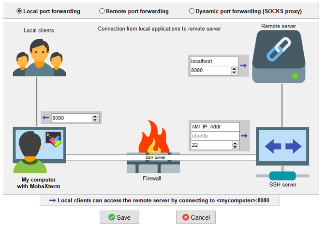
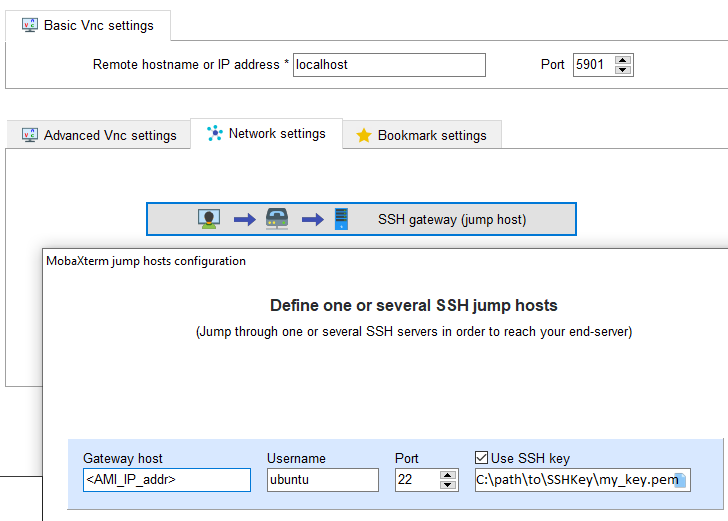

# Getting Started with Arm Virtual Hardware

*Accelerating MLOps in the cloud*

This README is a set of instructions for the workshop entitled [IoT DevOps Made Simple and Scalable in the Cloud](https://devsummit.arm.com/en/sessions/539) part of the DevSummit 2021 virtual conference.

**Table of contents**

1. [Prerequisites](#prerequisites)
2. [Accessing and launching the AMI](#amilaunch)
    - 2.1 [During the workshop](#workshop)
    - 2.2 [Find AMI on AWS Marketplace](#marketplace)
    - 2.3 [Launch the AMI from AWS EC2](#launch)
    - 2.4 [Enable AMI console](#console)
    - 2.5 [(Optional) Enable Code Server](#codeserver)
    - 2.6 [(Optional) Enable Virtual Network Computing (VNC)](#vnc)
3. [Import and build example](#buildexample)
    - 3.1 [Fork and clone example](#clone)
    - 3.2 [Build example within the AMI](#build)
    - 3.3 [Run the example in place](#run)
    - 3.4 [Edit example](#edit)
    - 3.5 [Submit changes back to GitHub](#push)
4. [Automated CI/CD with GitHub Actions](#actions)
    - 4.1 [Configure GitHub Actions](#confactions)
    - 4.2 [Setup runner on AMI](#runner)
    - 4.3 [GitHub Actions workflow](#workflow)
    - 4.4 [Demonstration of a failed workflow](#failure)
5. [To go further](#further)

## 1. Prerequisites

* a valid [Github](https://github.com/) account
* a valid [AWS](https://aws.amazon.com/) account
* a SSH (VNC) client installed: [PuTTY](https://www.chiark.greenend.org.uk/~sgtatham/putty/latest.html), [MobaXterm](https://mobaxterm.mobatek.net/)

## 2. Accessing and launching the AMI

### 2.1. During the workshop

Sections 2.2 and 2.3 can be skipped if you don't wish to use your own AWS account. A list of running instances with their IP will be provided during the workshop, with instructions on how to connect with SSH. You can go directly to [section 2.4](#console).

### 2.2. Find AMI on AWS Marketplace

1. Log into your [AWS account](https://aws.amazon.com/) and select *Elastic Compute Cloud (EC2)* service
2. Set region to *N.Virginia (us-east-1)* in top-right corner of the console
3. Locate *Images > AMIs* in the sidebar
4. Search Public Images for *Arm Virtual Hardware*

### 2.3. Launch the AMI from AWS EC2

1. Subscribe to the AMI

2. Choose **t3.medium** instance type and use default settings

3. Select key pair (or generate new key)

### 2.4. Enable AMI console

1. Use SSH command on Linux or MacOS:

    `ssh -i <key.pem> ubuntu@<AMI_IP_addr>`

    Or, if using MobaXterm on Windows:

    * Add new SSH session
    * Specify `<AMI_IP_addr>` as *Remote host*
    * Specify `ubuntu` as *username*
    * Enable *Use private key* and specify path to `<key.pem>`

    

	Or, if using PuTTY:
	
	* Use **PuTTYgen** to convert the .pem file to .ppk
	* Specify `ubuntu@<AMI_IP_addr>` in *Session > Host name*

    

	* Specify path to `key.pem` in *Session > Connection > SSH > Auth > Private key file for authentication*

    

### 2.5. [Optional] Enable [Code Server](https://github.com/cdr/code-server) (Visual Studio Code)

1. Start a SSH tunnel to the instance and forward port 8080. On Linux or MacOS:

    `ssh -I <key.pem> -N -L 8080:localhost:8080 ubuntu@<AMI_IP_addr>`

    Or, with MobaXterm on Windows:

    * Add new SSH tunnel
    * Specify `8080` in *My computer > Forwarded port*
    * Specify `<AMI_IP_addr>`  in *SSH server*
    * Specify `ubuntu` in *SSH login*
    * Specify `22` in *SSH port*
    * Specify `localhost` in *Remote server*
    * Specify `8080` in *Remote port*
    * Save configuration. Click on the key icon to specify the path to `<key.pem>`
    * Start the tunnel connection

    

2. Launch a web browser on your local machine and open the following URL: [http://localhost:8080](http://localhost:8080)

### 2.6. [Optional] Enable Virtual Network Computing (VNC)

In the AMI terminal:

1. Enable VNC password

    `vncpasswd`
    
2. Start VNC server

    `sudo systemctl start vncserver@1.service`

On your local machine:

3. Forward port 5901 on local machine​. On Linux or MacOS:

    `ssh -I <key.pem> -N –L 5901:localhost:5901 ubuntu@<AMI_IP_addr>​`

    Then, connect VNC client (e.g. Remmina, TigerVNC) to port 5901​. You will be prompted for password.

    Or, with MobaXterm on Windows:
    
    * Add new VNC session
    * Specify `localhost` as *Remote hostname*
    * Specify `5901` as *Port*
    * Select the *Network settings* tab configure the *SSH gateway* with:
        * `<AMI_IP_addr>` as *Gateway host*
        * `ubuntu` as *Username*
        * `22` as *Port*
        * Enable *Use SSH key* and specify path to `<key.pem>`

    

## 3. Import and build example

### 3.1. Fork and clone example

1. Open a web browser and enter the following URL: [https://github.com/ARM-software/VHT-TFLmicrospeech](https://github.com/ARM-software/VHT-TFLmicrospeech)
2. Log in to your github account and click on *Fork* (upper right)
3. In the AMI terminal:

        git config --global user.name “YourGitHubName"​
        git config --global user.email Your.Email@domain.com​
        git config --list​
        git clone https://github.com/<YourGitHubName>/VHT-TFLmicrospeech

### 3.2. Build example within the AMI

In the AMI terminal:

1. Navigate to build folder​

    `cd VHT-TFLmicrospeech/Platform_FVP_Corstone_SSE-300_Ethos-U55​`

2. Use cp_install utility (do once) to install necessary CMSIS Packs​

    `cp_install.sh packlist​`

3. Use cbuild to build .cprj project​

    `cbuild.sh microspeech.Example.cprj`

### 3.3. Run the example in place

In the AMI terminal:

1. Run script to load application to model and execute​

    `./run_example.sh (--cyclelimit 100000000)​`

2. Observe banner and output log​ (use Ctrl+C to terminate early if needed)

        Fast Models [11.16.14 (Sep 29 2021)]​
        Copyright 2000-2021 ARM Limited.​
        All Rights Reserved.​
        
        telnetterminal0: Listening for serial connection on port 5000​
        telnetterminal1: Listening for serial connection on port 5001​
        telnetterminal2: Listening for serial connection on port 5002​
        telnetterminal5: Listening for serial connection on port 5003​
        
        Ethos-U rev afc78a99 --- Aug 31 2021 22:30:42​
        (C) COPYRIGHT 2019-2021 Arm Limited​
        ALL RIGHTS RESERVED​
        
        Heard yes (144) @1100ms​
        Heard no (142) @5600ms​
        Heard yes (149) @9100ms​
        Heard no (142) @13600ms​
        
        …​
        
        --- cpu_core statistics: ------------------------------------------------------​
        Simulated time                          : 24.000002s​
        User time                               : 57.887562s​
        System time                             : 0.321178s​
        Wall time                               : 58.273418s​
        Performance index                       : 0.41​
        cpu_core.cpu0                           :  13.19 MIPS (   768000000 Inst)​
        -------------------------------------------------------------------------------​
​

### 3.4. Edit example

In the AMI terminal:

1. Navigate to source folder​

    `cd ../micro_speech/src/​`

2. Edit `command_responder.cc` and change output (e.g. add your name as below)​

        TF_LITE_REPORT_ERROR(error_reporter, “YourName Heard %s (%d) @%dms", found_command, score, current_time);

3. Save and rebuild, and run to verify change​

        cd ../../Platform_FVP_Corstone_SSE-300_Ethos-U55​
        cbuild.sh microspeech.Example.cprj​
        ./run_example.sh​

### 3.5 Submit changes back to GitHub

In the AMI terminal

1. mark changed file(s) you wish to submit​

        cd ../micro_speech/src/​
        git add .​

2. Commit changes, with arbitrary message​

        git commit –m “Added my name to output message”​

3. Verify the repository referenced is your forked copy​

        git remote –v​

4. Submit changes back to your repository​

        git push​

    You will be asked your login and Personal Access Token (password) information​

In Github, observe the change registered

`https://github.com/<YourGitHubName>/VHT-TFLmicrospeech​/blob/main/micro_speech/src/command_responder.cc​`

## 4. Automated CI/CD with GitHub Actions

### 4.1. Configure GitHub Actions

In GitHub

1. Navigate to *Settings > Actions > Runners*
2. Add `New self-hosted runner`

    

3. Select Linux, x64 Runner image and copy the commands to set up

    

### 4.2. Setup runner on AMI

In the AMI terminal

1. Go to base directory

        cd /home/ubuntu

2. Copy the commands from GitHub to configure
3. Once configured, use run.sh to start the runner on the AMI

        ./run.sh
        Connected to GitHub
        yyyy-mm-dd hh:mm:ss: Listening for Jobs

In Github
4. Go the *Runner* tab to see the runner listed and idle

    

### 4.3. GitHub Actions workflow

1. In Github, the file .github/workflows/virtual_hardware.yml defines the list of actions to perform (e.g. code checkout, build, run test script) on the runner and when (e.g. for every push to the repo)

2. **In a new AMI terminal**, revert your change in command_responder.cc and push to the repo

        git add .
        git commit -m "Original message"
        git push

3. **Back to the first AMI terminal where the runner has been started with ./run.sh**, the runner reports the status

        <timestamp>: Listening for Jobs
        <timestamp>: Running job: environment_setup
        <timestamp>: Job environment_setup completed with result: Succeeded

4. In GitHub, locate the *Actions* sections and inspect the history of the workflow runs on the AMI instance

    

### 4.4. Demonstration of a failed workflow

1. Change the code to be non-valid C e.g. edit `command_responder.cc` and remove the semicolon at the end of the line:

        TF_LITE_REPORT_ERROR(error_reporter, “YourName Heard %s (%d) @%dms", found_command, score, current_time)

2. Commit change to GitHub

        git add .
        git commit -m "Example of failure"
        git push

3. Observe in AMI that the runner reports failure

        <timestamp>: Running job: ci_demonstration
        <timestamp>: Job ci_demonstration completed with result: Failed

   Same in GitHub's *Actions* tab

### 5. To go further

The Machine Learning Group at Arm have developed [other examples](https://review.mlplatform.org/plugins/gitiles/ml/ethos-u/ml-embedded-evaluation-kit/) which can be run in with the Arm Virtual Hardware AMI.

The instructions in the [quick start guide](https://review.mlplatform.org/plugins/gitiles/ml/ethos-u/ml-embedded-evaluation-kit/+/HEAD/docs/quick_start.md) are easily reproducible in the AMI. You will need to enable VNC to visualize.

        VHT-Corstone-300 -a ethos-u-img_class.axf -C cpu_core.ethosu.extra_args="--fast"